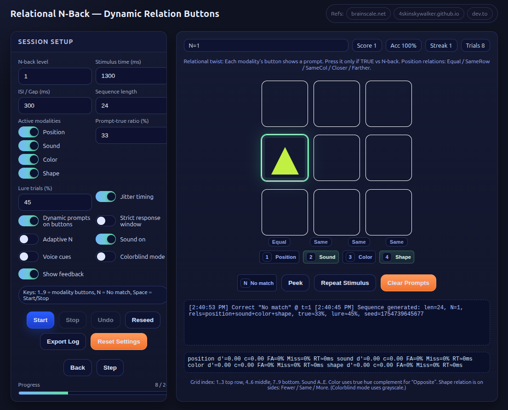

# Relational N-Back — Dynamic Relation Buttons



## Overview

**Relational N-Back — Dynamic Relation Buttons** is an advanced cognitive training tool designed to target **fluid intelligence** and **interference control** through *relational reasoning* rather than simple pattern matching.

Instead of only answering “is it the same?”, each trial asks *which specific relation is true* compared to N steps back, across multiple modalities, with heavy near-miss lures.

This approach trains the exact mental operations demanded by high-level IQ test puzzles — rapid, precise comparisons under noise — while exercising working memory, processing speed, and focus.

---

## How It Began

From 2019–2025, I explored nearly every “brain training” method:
- IQ books
- Brain games
- Meditation
- Supplements
- Dual N-Back
- Languages
- Logic puzzles

Many helped, but the real breakthrough came when I reframed problem solving as:
> A sequence of quick, clean comparisons —  
> *Same vs Different*, *Before vs After*, *Bigger vs Smaller*, *Part vs Whole*.

I realized most N-Back tools only train “is it identical?”, but real reasoning problems require “which relation is true right now?”.  
So I built a trainer from scratch — using **GPT-5** for code generation and **Grok-4** for debugging — to deliberately practice this skill.

---

## What It Does

- Presents simultaneous stimuli in **4 active modalities**:
  1. **Position** (3×3 grid)
  2. **Sound** (letters A–E)
  3. **Color** (color-blind-safe palette)
  4. **Shape** (circle, triangle, square)

- Each modality’s button displays a **dynamic relational prompt**:
  - **Position:** Equal / SameRow / SameCol / Closer / Farther
  - **Sound:** Before / Same / After
  - **Color:** Same / Opposite (true complement)
  - **Shape:** Fewer / Same / More (by number of sides)

- Includes **near-miss lures**: prompts that feel “almost right” but are false, forcing deeper discrimination.

- Tracks detailed **Signal Detection Theory** stats per modality:
  - d′ (sensitivity)
  - c (bias)
  - FA% / Miss%
  - Median RT

- Supports:
  - Adaptive N-level adjustment
  - Strict/open response windows
  - Color-blind mode
  - Voice cues
  - Manual step-through review mode
  - CSV export of trial data

---

## How It Works

1. **Sequence Generation**
   - A random seed creates a sequence of stimuli for all active modalities.
   - Each stimulus is adjusted to match TRUE, LURE, or FOIL conditions for the current prompt.

2. **Prompt Scheduling**
   - Every trial has a pre-assigned relational prompt per modality.
   - Prompts are balanced across the run.

3. **Presentation**
   - The current stimulus is shown in the grid with shape and color.
   - Audio tone plays for the “sound” modality; voice cues optional.
   - Buttons display prompts dynamically.

4. **Response**
   - Press the modality button if the prompt is TRUE for the item N steps back.
   - Press **No Match** if none are true.

5. **Feedback & Scoring**
   - Optional visual/audio feedback.
   - Accuracy, score, streak, and per-modality metrics update live.

---

## How to Use

1. **Clone this repo**  
   ```bash
   git clone https://github.com/yourusername/relational-n-back.git
   cd relational-n-back
   ```

2. **Open the HTML file** in your browser:
   ```bash
   open relational-n-back.html
   ```

3. **Set your session parameters** in the left panel:
   - N-back level
   - Stimulus time & gap
   - Sequence length
   - Active modalities
   - Lure percentage, prompt ratio, etc.

4. **Start training**
   - Press **Space** or click **Start**.
   - Use keys `1..9` for modality buttons, `N` for No Match.
   - Press `?` to open in-app help.

5. **Review and export**
   - Use **Step** / **Back** in manual mode to study trials.
   - Export CSV logs for analysis.

---

## My Recommended Training Settings

- **Lures:** 45–50%
- **Stimulus Time:** 2000–2500ms (with jitter on)
- **Strict Window:** ON
- **Dynamic Prompts:** ON
- **Adaptive N:** Optional after baseline

Play 15–20 minutes daily, only press when certain.

---

## License

[MIT License](LICENSE)

---

## Acknowledgments

Inspired by:
- [brainscale.net](https://brainscale.net/app/dual-n-back/training)
- [4skinskywalker’s dichotic N-Back](https://4skinskywalker.github.io/Lite-Dual_N-back/Dichotic_Dual_N-back/)
- Community discussions on relational N-Back variants

---
